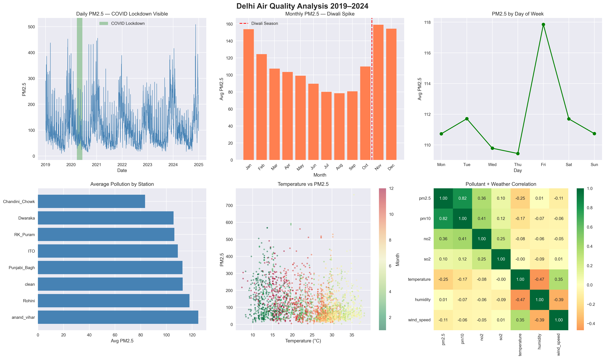
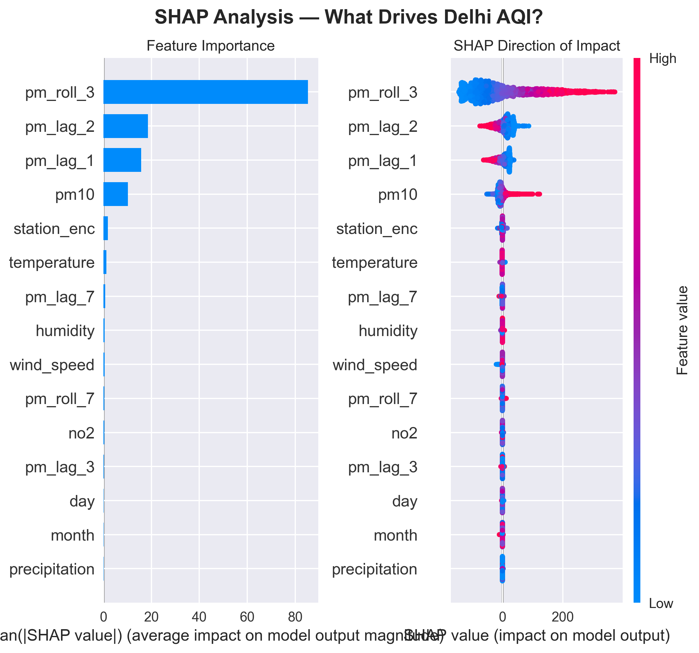

# Delhi Air Quality Analysis 2019–2024
### End-to-end pollution prediction & pattern mining using real government sensor data

---

## Overview

This project analyzes air quality across 7 Delhi monitoring stations from 2019 to 2024 using real hourly data from India's Central Pollution Control Board (CPCB). It combines pollution data with historical weather data to build a machine learning model that predicts next-day PM2.5 levels, and uses SHAP to explain what drives pollution in Delhi.

---

## Results

| Metric | Value |
|---|---|
| R² Score | 0.98 |
| MAE | 6.39 |
| Training Data | 2019–2022 |
| Test Data | 2023–2024 |
| Total Records | 19,376 |

---

## Key Findings

- **3-day rolling PM2.5 average** is the strongest predictor of next-day AQI
- **Diwali season (Oct–Nov)** shows the highest pollution spikes across all stations
- **COVID lockdown (Mar–Jun 2020)** caused a significant and visible drop in PM2.5 levels
- **Anand Vihar** consistently records the worst air quality among all stations
- **Wind speed and humidity** are the most influential weather factors on pollution levels

---

## Dataset

- **Source:** Central Pollution Control Board (CPCB) — cpcb.nic.in
- **Stations:** Anand Vihar, ITO, Dwarka, Rohini, Punjabi Bagh, RK Puram, Chandni Chowk
- **Period:** January 2019 – December 2024
- **Frequency:** Daily (24-hour average)
- **Pollutants:** PM2.5, PM10, NO, NO2, NOx, NH3, SO2, CO, Ozone
- **Weather:** Temperature, Humidity, Wind Speed, Precipitation (via Open-Meteo API)

---

## Project Structure
```
Delhi_Air_Quality/
├── Data/
│   ├── anand_vihar/
│   ├── Chandini_Chowk/
│   ├── Dwaraka/
│   ├── ITO/
│   ├── Punjabi_Bagh/
│   ├── RK_Puram/
│   └── Rohini/
├── data_clean/
│   ├── delhi_aqi_clean.csv
│   └── delhi_aqi_weather.csv
├── dehi_AQI_analysis.ipynb
├── delhi_aqi_eda.png
└── delhi_aqi_shap.png
```

---

## Methodology

### Phase 1 — Data Collection
Downloaded 42 CSV files from CPCB covering 7 Delhi monitoring stations across 6 years.

### Phase 2 — Data Cleaning
- Handled mixed date formats between 2019–2022 and 2023–2024 files
- Forward-filled missing sensor readings (max 3-day gap)
- Filled remaining gaps using station monthly median

### Phase 3 — Weather Integration
Fetched daily historical weather data for Delhi using the Open-Meteo archive API — temperature, humidity, wind speed, and precipitation from 2019 to 2024.

### Phase 4 — EDA
Generated 6 visualizations uncovering COVID lockdown drop, Diwali spikes, station comparison, and weather correlation.

### Phase 5 — Feature Engineering
Created 20+ time-series features including lag features (1, 2, 3, 7 days), rolling averages (3-day, 7-day), and season flags.

### Phase 6 — XGBoost Model
Time-based train/test split (2019–2022 train, 2023–2024 test). Achieved R²=0.98, MAE=6.39.

### Phase 7 — SHAP Explainability
Used SHAP TreeExplainer to identify the most influential features driving AQI predictions.

---

## Visualizations

### EDA — Pollution Patterns


### SHAP — Feature Importance


---

## Tech Stack

| Tool | Purpose |
|---|---|
| Python 3.13 | Core language |
| Pandas | Data manipulation |
| NumPy | Numerical computing |
| Matplotlib & Seaborn | Visualizations |
| XGBoost | ML model |
| SHAP | Model explainability |
| Scikit-learn | Preprocessing & metrics |
| Open-Meteo API | Weather data |

---

## Setup
```bash
pip install pandas numpy matplotlib seaborn scikit-learn xgboost shap openmeteo-requests requests-cache retry-requests
```

---

## Author

**Adithya**